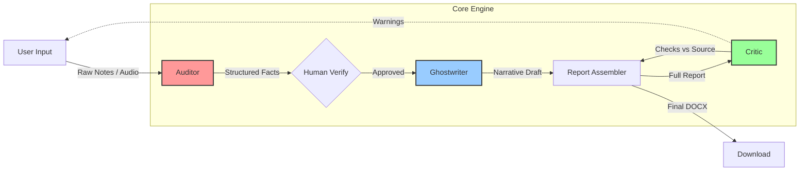

<div align="center">

# 🫘 Bean
### The Event Reporter

**"Turn messy notes into professional IEEE reports in seconds."**


</div>

---

## About
**Bean** is an agentic AI workflow designed to automate the tedious documentation process for student branches and technical chapters. Instead of manually compiling event reports, you simply feed Bean your raw, unstructured notes (or voice memos), and it uses a strict **Auditor-Ghostwriter-Critic** pipeline to generate a pristine, professionally formatted report.

It doesn't just "summarize"—it **extracts facts**, **drafts narratives**, and **self-corrects** to ensure zero hallucinations.

## Key Features

### The Auditor (Fact Extraction)
- Runs at `Temperature 0.0`.
- Acts as a strict data entry clerk.
- Extracts dates, numbers, names, and lists into a rigid `Pydantic` schema.
- **Goal**: Absolute Truth.

### The Ghostwriter (Creative Draft)
- Runs at `Temperature 0.3`.
- Takes the Auditor's facts and weaves them into a professional Executive Summary and Key Takeaways.
- Matches the tone of an IEEE technical report.
- **Goal**: Professional Polish.

### The Critic (Compliance Check)
- Compares the final Generated Report against your Original Notes.
- Flags any "hallucinated" facts that weren't in your source text.
- **Goal**: Trust & Safety.

---

## Architecture

The strength of Bean lies in its multi-agent chain. It is not a single prompt, but a pipeline of specialized roles.



---

## Tech Stack

| Component | Technology | Description |
| :--- | :--- | :--- |
| **Frontend** | `Streamlit` | Fast, reactive UI for the agent interface. |
| **LLM Orchestration** | `Google GenAI SDK` | Interface for Gemini 2.5 Flash. |
| **Data Validation** | `Pydantic` | Strict schema definition and type checking. |
| **Document Gen** | `python-docx` | Programmatic creation of Word documents. |

---

## Getting Started

### Prerequisites
- Python 3.10 or higher.
- A **Google Gemini API Key** (Get one [here](https://aistudio.google.com/)).

### Installation

1. **Clone the repository**
   ```bash
   git clone https://github.com/ahadullabaig/bean.git
   cd bean
   ```

2. **Install dependencies**
   ```bash
   pip install -r requirements.txt
   ```

3. **Run the Application**
   ```bash
   streamlit run app.py
   ```

### Usage Flow
1. **Input Phase**: Paste your raw notes or record audio.
2. **Verification Phase**: Review the "Smart Form" pre-filled by the **Auditor**. Edit any wrong numbers.
3. **Generation Phase**: Watch the **Ghostwriter** and **Critic** work.
4. **Download**: Export your final `.docx` report.

---

## 📂 Directory Structure

```graphql
bean/
├── app.py                # Main Application Entry Point
├── core/                 # The Brains
│   ├── auditor.py        # Fact Extraction Logic
│   ├── ghostwriter.py    # Narrative Generation Logic
│   ├── critic.py         # Hallucination Checker
│   └── llm.py            # Gemini Client Wrapper
├── models/               # Data Structures
│   └── schemas.py        # Pydantic Models for Events
├── ui/                   # Frontend Components
│   ├── components.py     # Reusable UI Widgets
│   └── handlers.py       # Input Processors
└── assets/               # Static Images
```
